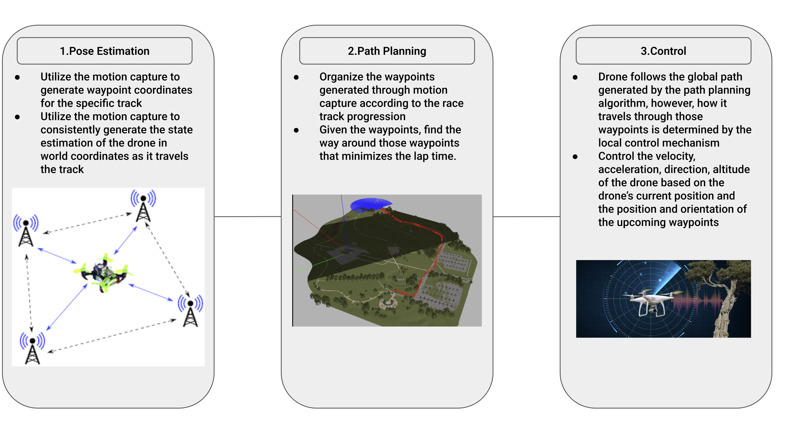
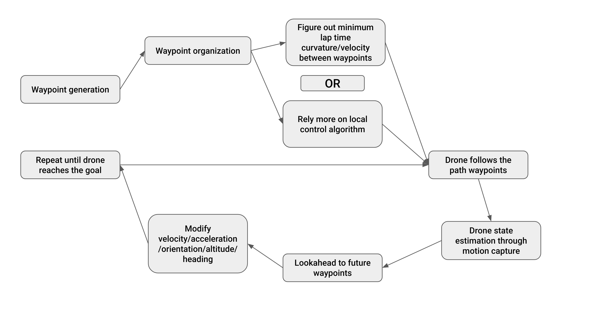
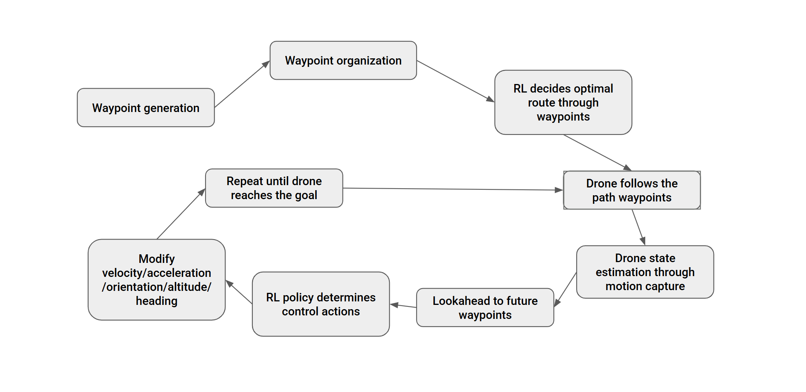

::: {.hero-section}

# ECE 484 Skynet {.title}

::: {.subtitle}
A catchy one-line description of your project
:::

::: {.author-list}
<span style = "color: blue;">

**Mira Panigrahy**^1,2^,
**Allen Wu**,^1,2^
**Juheon Woo**^1,2^

</span>
:::

::: {.affiliation-list}

^1^University of Illinois Urbana-Champaign,  ^2^ECE 484

:::

::: {.button-row}

[[ Code]{.btn-text}](https://github.com/safeautonomy-illinois-students/project-site-skynet2-0.git){.btn .btn-primary}


:::

:::


<!-- ============================================================ -->
<!-- TEASER IMAGE / VIDEO -->
<!-- ============================================================ -->

::: {.section-container}

::: {.hero-teaser}

<!-- Option A: Use a static image as the teaser -->
{.teaser-img}

<!-- Option B: Embed a video teaser (uncomment below, comment out image above)

-->

:::

:::


<!-- ============================================================ -->
<!-- ABSTRACT -->
<!-- ============================================================ -->

::: {.section-container}

## Abstract {.section-title}

::: {.abstract-text}

Our goal is to program a quadrotor to autonomously navigate through a series 
of gates or objects without collisions. In order to implement this, we will 
have four phases: Pose Estimation, Perception, Path Planning, and Control. 
These phases combined together allow the drone to determine its current state, 
understand its surroundings, plan a safe route through the environment, and 
generate control commands to execute that motion.

:::

:::

<!-- ============================================================ -->
<!-- APPROACH -->
<!-- ============================================================ -->

::: {.section-container}

## Approach {.section-title}

::: {.abstract-text} 

For pose estimation we need the pose, velocity, acceleration, and orientation 
of the drone. Pose = (x, y, z, roll, pitch, yaw), Velocity = (vx, vy, vz). For the 
pose, we will use the motion capture system to detect the x, y, and z coordinates as 
well as orientation in the world coordinate frame, keeping track of the state estimation. 
We will use the IMU (Inertial Measurement Unit) to estimate which way the drone is 
facing and its linear acceleration using a gyroscope and accelerometer. We can also 
use a Range Sensor to estimate the quadrotor’s exact altitude. Similarly with the track 
waypoints, we utilize the motion capture to generate world coordinates of the track for 
the drone to follow at the start of the lap. We will then pass on this information to 
the perception and planning phases of our pipeline.

For perception, we will assume that the positions of the gates and obstacles are known 
ahead of time. These positions can be defined in the world coordinate frame. 
Since the drone’s pose is estimated using the motion capture system, 
we can compare its current position to the known positions of the gates to determine 
where it should go next. We will pass the known gate coordinates directly 
to the path planning unit, which will use them to generate the sequence of waypoints 
the drone should follow to safely move through the course.

The path planning unit will create the list of waypoints (or update them in real time) 
that the quadrotor should take to successfully avoid collisions and go through all the 
gates. This will be done by analyzing where the center of the gates are in the world 
and creating a smooth path that goes through all of them while not hitting anything 
else. The list of waypoints will be given to the control unit.

The control system has to update the quadrotor’s acceleration, velocity, heading, or 
position so that it is able to move through all the waypoints smoothly. To implement 
this successfully we will try different control models like PID, and tune parameters 
through testing. We will finally have to convert the control data to motor control for 
the quadrotor.


::: 

::: 

## Non-RL Way {.section-title}

{fig-align="center" width="800"}
{fig-align="center" width="800"}

## RL Way {.section-title}

{fig-align="center" width="800"}


:::{.content-text}
<span style="font-size:0.8em; font-weight: normal;">

**Image sources**

-Pose Estimation image:
[ResearchGate](https://www.researchgate.net/figure/UAV-pose-estimation-based-on-DS-TWR-After-the-configuration-of-the-fixed-anchors-is_fig2_328090941){style="text-decoration: underline;"}

-Path Planning image: 
[Robotics StackExchange](https://robotics.stackexchange.com/questions/110690/how-to-extend-the-reach-of-global-path-planning-in-nav2-for-large-open-areas){style="text-decoration: underline;"}

-Control image:
[Kritical Solutions](https://kritikalsolutions.com/enhancing-drone-safety-with-obstacle-avoidance/){style="text-decoration: underline;"}

</span>
:::


<!-- ============================================================ -->
<!-- OVERVIEW / METHOD VIDEO -->
<!-- ============================================================ -->

::: {.section-container}

## Video {.section-title}

::: {.video-container}
<!-- Replace with your YouTube or local video embed -->

:::

:::


<!-- ============================================================ -->
<!-- RESULTS GALLERY -->
<!-- ============================================================ -->

::: {.section-container}

## Results {.section-title}


::: {.content-text}
Provide a brief description of the results shown below. Explain what the
reader should observe and why it matters.
:::

::: {.content-text .text-center} 
No results yet!
:::

:::


<!-- ============================================================ -->
<!-- QUALITATIVE COMPARISONS -->
<!-- ============================================================ -->

::: {.section-container}

## Qualitative Comparisons {.section-title}

::: {.content-text}
Describe the comparison setup — which baselines are you comparing against, and
what should the reader look for in the side-by-side results.
:::

::: {.content-text .text-center}
No qualitvative comparisons yet!
:::


<!-- ============================================================ -->
<!-- INTERACTIVE SLIDER (Optional) -->
<!-- ============================================================ -->

::: {.section-container}

## Interpolation Demo {.section-title .text-center}

::: {.content-text .text-center} 
Interpolation demo unavailable at the moment
:::

## Milestones and Teamwork {.section-title .text-center}
::: {.content-text .text-center} 
Milestone 1 (Week of 9th): Simulation Setup Complete, High Level Design In Progress
Milestone 2: Upcoming

Different parts of the path planning and controller functions will be divided evenly among each member. Path Planning will be worked on first along with
waypoint generation and organization. Each member is expected to finish up their function before weekly meetings and implementation and debugging will be done altogether.

:::

<!-- ============================================================ -->
<!-- RELATED WORK -->
<!-- ============================================================ -->

::: {.section-container}

## Related Work {.section-title}

::: {.content-text}

Here are some related works in this area:

- [Track Maneuvering using PID Control for Self-Driving Cars](https://www.researchgate.net/publication/331475267_Track_Maneuvering_using_PID_Control_for_Self-Driving_Cars) introduces PID control for self driving cars and this could be applicable to drones the same way
- [Application of PID Control Technology in Unmanned Aerial Vehicles](https://www.researchgate.net/publication/386138601_Application_of_PID_Control_Technology_in_Unmanned_Aerial_Vehicles) introduces PID control specific to drones
- [MIT research paper](https://dspace.mit.edu/bitstream/handle/1721.1/64669/706825301-MIT.pdf) gives detailed explanation of how minimize path curvature within tracks
- [Goergia Tech research paper](https://dcsl.gatech.edu/papers/isie05b.pdf) explains computing velocity at different points of the track that will minimize the lap time
- [IBM article](https://www.ibm.com/think/topics/reinforcement-learning) explains reinforcement learning, which is a possible implementaion we might add
:::

:::


<!-- ============================================================ -->
<!-- BIBTEX -->
<!-- ============================================================ -->

::: {.section-container}

## BibTeX {.section-title}

```bibtex
@article{TrackManeuveringusingPID,
  author    = {Wael A. Farag},
  title     = {Track Maneuvering using PID Control for Self-Driving Cars},
  journal   = {ResearchGate},
  year      = {2019},
}


@article{RacingLineOptimization,
  author    = {Ying Xiong},
  title     = {Racing Line Optimization},
  journal   = {DSpace@MIT},
  year      = {2010},
}


@article{OptimalVeloictyProfileGeneration,
  author    = {E. Velenis and P.Tsiotras},
  title     = {Optimal Velocity Profile Generation for given
Acceleration Limits; The Half-Car Model Case},
  journal   = {DCSL - Georgia Institute of Technology},
  year      = {2005},
}


@article{PIDControlTechnologyInUnmannedAerialVehicles,
  author    = {Mingrui Shi},
  title     = {Application of PID Control Technology in Unmanned Aerial Vehicles},
  journal   = {ResearchGate},
  year      = {2024},
}


@article{reinforceIBM,
  author    = {Jacob Murel and Eda Kavlakoglu},
  title     = {What is reinforcement learning?},
  journal   = {IBM},
  year      = {2024},
}
```
:::


<!-- ============================================================ -->
<!-- FOOTER -->
<!-- ============================================================ -->

::: {.site-footer}

This website template is adapted from the
[Nerfies](https://nerfies.github.io) project page, which is licensed under a
[Creative Commons Attribution-ShareAlike 4.0 International License](http://creativecommons.org/licenses/by-sa/4.0/).

:::
